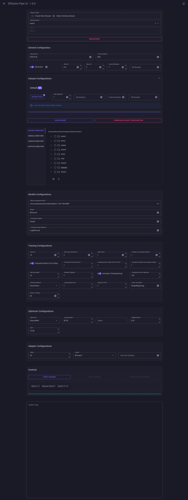

### Diffusion Pipe Interface

This repository is a fork of [diffusion-pipe](https://github.com/tdrussell/diffusion-pipe) dedicated exclusively to the new web interface developed in .NET/Blazor. It aims to simplify LoRA and other model training, allowing usage in both containerized environments and manual execution.

---

## Blazor Interface




## Cloning the Repository

Clone the repository with submodules using:

```bash
git clone --recurse-submodules https://github.com/alisson-anjos/diffusion-pipe-ui && cd diffusion-pipe-ui && git checkout new-ui
```

If you already cloned it without submodules, run:

```bash
git submodule init
git submodule update
```

---

## Updates

- **2025-03-19 (new interface with support for all models)**
  - New interface developed in Blazor (dotnet).
  - Settings (paths, training commands, model downloads, etc.) are defined in the `appsettings.json` file (located at `diffusion-pipe/ui/deploy/appsettings.json`).
  - Integrated environment variables for container use, such as:
    - `DOWNLOAD_MODELS`: (true/false) � controls whether models are automatically downloaded.
    - `MODEL_GROUPS`: list of model groups to be processed (e.g., `"wan,hunyuan"`).
    - `WAN_VARIANTS`: if the "wan" group is configured, specifies the variants to download (e.g., `"I2V480P,T2V480P-14B"`).
  - Support for parallelism configuration via the **NUM_GPUS** parameter (or the `--num_gpus` flag).

- **2025-01-17 (diffusion-pipe original)**
  - Fixes and improvements in training, including adjustments for hunyuanvideo VAE and enhancements in the quality of trained LoRAs.
---

## Important Differences in This Fork

This fork introduces changes that are not compatible with the original repository's settings. Notable differences include:

- **WandB Support:** Integrated for enhanced training monitoring.
- **Adapter Naming:** When saving an adapter, it is saved using the dataset name (plus epoch) instead of a fixed filename.
- **Other Configuration Changes:** Some settings and behaviors differ from the original diffusion-pipe. Please review the configuration carefully if you are migrating from the original [diffusion-pipe](https://github.com/tdrussell/diffusion-pipe).

---

## Interface Settings

The essential settings for the interface are defined in the `appsettings.json` file located at `diffusion-pipe/ui/deploy/appsettings.json`. Below is an overview of the main parameters:

### ConnectionStrings

- **App**  
  _Currently, this setting is not in use._

### Configurations

This section defines the paths and commands required for the interface to interact with data and models:

- **DatasetsPath, ConfigsPath, OutputsPath, and ModelsPath**  
  These specify the directories where the interface will look for datasets, store configuration files, outputs, and locate existing models.  
  _Example:_  
  ```json
  "DatasetsPath": "/home/alissonerdx/workspace/datasets",
  "ConfigsPath": "/home/alissonerdx/workspace/configs",
  "OutputsPath": "/home/alissonerdx/workspace/outputs",
  "ModelsPath": "/home/alissonerdx/models"
  ```

- **Models**  
  Each model has specific settings, such as paths for checkpoints, diffusers, transformers, VAEs, etc. Placeholders (e.g., `{ModelsPath}`) will be replaced with the value set in **ModelsPath**.  
  _Example for hunyuan:_  
  ```json
  "Hunyuan": {
    "CkptPath": "{ModelsPath}/hunyuan/official",
    "TransformerPath": "{ModelsPath}/hunyuan/hunyuan_video_720_cfgdistill_fp8_e4m3fn.safetensors",
    "VaePath": "{ModelsPath}/hunyuan/hunyuan_video_vae_bf16.safetensors",
    "ClipPath": "{ModelsPath}/hunyuan/clip-vit-large-patch14",
    "LlmPath": "{ModelsPath}/hunyuan/llava-llama-3-8b-text-encoder-tokenizer"
  }
  ```

- **EnvPath**  
  Defines the path to the virtual environment containing the dependencies required for training.

- **UploadChunkFileSizeInMB** and **MaxFileSizeInMB**  
  Configure, respectively, the chunk size for uploads and the maximum allowed file size for files sent via the interface.

- **NameDatasetDefault**  
  Defines a default name for datasets if none is specified.

- **UsingDiffusionPipeFromFork**  
  This option exists because the fork includes changes not present in the original repository. When set to true, it enables extra features (such as monitoring fields with WandB integration) to appear on the interface. If you are using the original repository, this option will have no effect.

- **DiffusionPipePath**  
  The path to the Diffusion Pipe repository. This is used in the training command to locate the necessary scripts.

- **StartTrainingCommand**  
  The command the interface uses to start training. It includes activating the virtual environment and invoking DeepSpeed with the configured parameters.  
  _Example:_  
  ```json
  "StartTrainingCommand": "source {EnvPath}/bin/activate && NCCL_P2P_DISABLE=\"1\" NCCL_IB_DISABLE=\"1\" deepspeed --num_gpus=1 {DiffusionPipePath}/train.py --deepspeed --config {TrainConfig}"
  ```

---

## Prerequisites

- **Docker**  
  Install [Docker](https://docs.docker.com/get-docker/) for your platform (Windows, Linux, or macOS).

- **GPU (optional)**  
  To use NVIDIA acceleration, install the [NVIDIA Container Toolkit](https://docs.nvidia.com/datacenter/cloud-native/container-toolkit/install-guide.html) (Linux) or configure support as needed on Windows/macOS.

- **.NET 9 (for Manual Execution)**  
- [How to install](https://dotnet.microsoft.com/en-us/download)
- For manual execution on Linux, install the .NET 9 runtime. On Ubuntu, you can install it with:
  ```bash
  sudo apt update
  sudo apt install software-properties-common
  sudo add-apt-repository ppa:dotnet/backports
  sudo apt update
  sudo apt install aspnetcore-runtime-9.0
  ```
  > If you encounter an error with `add-apt-repository`, ensure that `software-properties-common` is installed.

---

## Supported Model Groups for Automatic Download

When using automatic model downloads in the container, you can specify which model groups to download by setting the `MODEL_GROUPS` environment variable. Supported model groups include:

- **sdxl**
- **chroma**
- **cosmos**
- **flux**
- **ltx**
- **lumina**
- **wan**
- **hunyuan**

For the **wan** model group, you can further specify which variants to download using the `WAN_VARIANTS` environment variable. Supported WAN variants include:

- **I2V480P**
- **I2V720P**
- **T2V480P-1.3B**
- **T2V480P-14B**

---

## Usage Modes

This repository offers three execution options:

1. **Container Use via RunPod**  
   Ideal for deploying the interface in the cloud, where the image is automatically downloaded and run.  
   [Deploy on RunPod](https://runpod.io/console/deploy?template=njiks0yigu&ref=8t518hht)

2. **Local Container Use**  
   Run the interface inside a Docker container on your local machine, using environment variables to, for example, control automatic model downloads.

3. **Manual Execution (Without Docker)**  
   For direct use of the fork:  
   - Configure `appsettings.json` (located at `diffusion-pipe/ui/deploy/appsettings.json`), adjusting paths according to your system�s structure.  
   - Manually download the models and place them in the specified directories.  
   - For advanced interface customization, use the Visual Studio project located in `diffusion-pipe/ui/project` (the version in `ui/deploy` is precompiled).

> **Important:** Some settings and behaviors in this fork differ from the original repository. Please review the configuration carefully if you are migrating from the original [diffusion-pipe](https://github.com/tdrussell/diffusion-pipe).

---

## Running with Docker

### Example Commands

#### 1. Without Automatic Model Download

```bash
docker run --gpus all -d -p 8888:8888 -p 6006:6006 -p 5000:5000 -e DOWNLOAD_MODELS=false alissonpereiraanjos/diffusion-pipe-new-ui:latest
```

#### 2. With Model Download (e.g., wan and hunyuan)

```bash
docker run --gpus all -d -p 8888:8888 -p 6006:6006 -p 5000:5000 \
  -e DOWNLOAD_MODELS=true \
  -e MODEL_GROUPS="wan,hunyuan" \
  -e WAN_VARIANTS="I2V480P,T2V480P-14B" \
  alissonpereiraanjos/diffusion-pipe-new-ui:latest
```

#### 3. With Directory Mapping and Model Download

```bash
docker run --gpus all -d -p 8888:8888 -p 6006:6006 -p 5000:5000 \
  -e DOWNLOAD_MODELS=true \
  -e MODEL_GROUPS="wan,hunyuan" \
  -e WAN_VARIANTS="I2V480P,T2V480P-14B" \
  -v /path/on/host/models:/workspace/models \
  -v /path/on/host/outputs:/workspace/outputs \
  -v /path/on/host/datasets:/workspace/datasets \
  -v /path/on/host/configs:/workspace/configs \
  alissonpereiraanjos/diffusion-pipe-new-ui:latest
```

*Note:*  
The container uses the **NUM_GPUS** parameter as defined in the training command or in the `appsettings.json` configuration. Adjust this according to your hardware setup.

### Updating the Image

To ensure you are using the latest version:

```bash
docker pull alissonpereiraanjos/diffusion-pipe-new-ui:latest
```

---

## Manual Execution (Without Docker)

If you choose to run the interface manually:

1. **Clone the repository** from the fork and install the dependencies according to the repository instructions.

2. **Configure `appsettings.json`:**  
   - Located at `diffusion-pipe/ui/deploy/appsettings.json`.  
   - Adjust the paths for datasets, configs, outputs, and models according to your system�s structure.  
   - **Note:** In this mode, automatic model downloading will not occur; you must download the models manually and place them in the specified directories.

3. **Install .NET 9:**  
   For manual execution on Linux, install the .NET 9 runtime as described in the prerequisites.

4. **Start the Interface:**  
   - To run the precompiled version of the interface, navigate to the `ui/deploy` folder and execute:
     ```bash
     dotnet ui/deploy/DiffusionPipeInterface.dll --urls=http://0.0.0.0:5000
     ```
   - For further customization of the interface, use the Visual Studio project located in `diffusion-pipe/ui/project`, as the version in `ui/deploy` is precompiled.

> **Preview of the Interface:**  
> When running, you will see a modern web UI with options for configuring training parameters, monitoring progress (with WandB integration if enabled), and viewing training metrics via Tensorboard.

---

## Linux Initialization Script

The `start-new-ui.sh` script automates the initial setup and launch of the Blazor interface. It performs the following tasks:

- Checks if this is the first initialization and, if configured, downloads the models (using environment variables � container only).
- Configures the necessary environment variables.
- Executes the Blazor interface (eliminating the need to manually run the startup command).

To run the script, simply execute:

```bash
./start-new-ui.sh
```

---

## Additional Information

- **Network Volume:**  
  When deploying on platforms like RunPod, it is advisable to create a Network Volume (at least 100GB) to store your models and training data. This avoids repeated downloads of models and speeds up initialization for subsequent runs.

- **Features:**  
  - Docker Image  
  - Web UI (Blazor) for configuring and executing LoRA training  
  - Optional NVIDIA GPU support for accelerated training  
  - Ability to map host directories (models, outputs, datasets, configs) into the container  
  - Optional automatic download of required models on first initialization (container only)  
  - Integrated WandB support for enhanced training monitoring  
  - Adapter saving that uses the dataset name (plus epoch) instead of a fixed filename  
  - Tensorboard for visualizing training metrics  
  - Jupyter Lab for file management
  - Restoring training data and logs if the page is updated during training (partial)

- **Improvements for the Future:**  
  - Generating sample outputs between epochs to visualize the impact of LoRA modifications

---

## Final Considerations

- **Focus on the New Interface:**  
  This version is exclusively dedicated to the new Blazor interface, incorporating the latest improvements and features to streamline training.

- **Directory Mapping:**  
  If using Docker, ensure that the mapped volumes (models, outputs, datasets, configs) are correctly configured so that the interface can locate existing data on your system.

- **Environment Variables (for Container):**  
  The variables `DOWNLOAD_MODELS`, `MODEL_GROUPS`, and `WAN_VARIANTS` are essential for automatic model downloads in the container. For manual execution, you must download models in advance.

- **Parallelism:**  
  To utilize multiple GPUs, adjust the **NUM_GPUS** parameter (or use the `--num_gpus` flag) according to your hardware configuration.

- **Local Configuration (Without Docker):**  
  In local environments, especially on Windows, adjust the paths in `appsettings.json` to reflect your directory structure.

- **Important Differences:**  
  This fork introduces key changes compared to the original repository:
  - **WandB Support:** Integrated for enhanced training monitoring.
  - **Adapter Naming:** When saving an adapter, it is saved using the dataset name (plus epoch).
  - **Other Configuration Changes:** Some settings differ from the original diffusion-pipe, so be careful when migrating configurations.

For any questions or issues, please open an issue or contact me via [my Civitai profile](https://civitai.com/user/alissonerdx).
